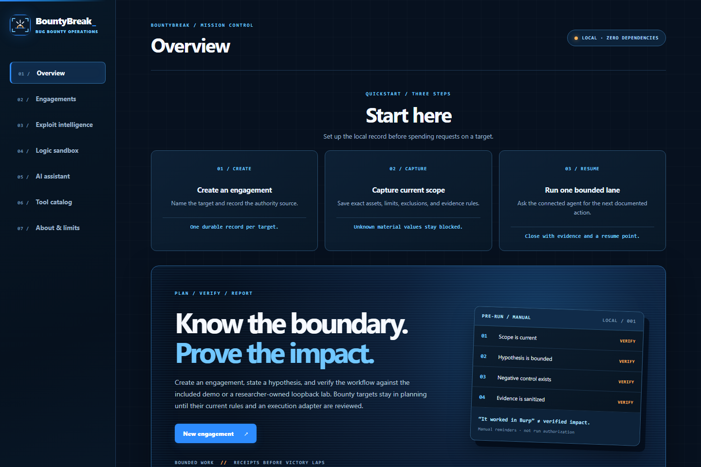
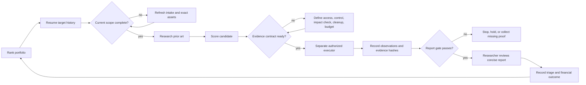

<p align="center">
  
</p>

<h1 align="center">BountyBreak</h1>

<p align="center"><strong>Bug bounty operations for approved Daybreak Blue workflows.</strong></p>

<p align="center">
  
  
  
  
  
  
</p>

<h2 align="center">Quickstart</h2>

<div align="center">

| 1. Start | 2. Connect | 3. Resume |
|---|---|---|
| `python workbench.py --open` | `codex mcp add bountybreak -- python C:/path/to/bountybreak/bountybreak_daybreak_server.py --data-dir C:/private/bountybreak-data --sandbox-distro Ubuntu` | Ask Daybreak Blue to open the BountyBreak portfolio and return the next bounded action. |

</div>



BountyBreak supplies the durable operating context around an approved Daybreak Blue workflow: target selection, current scope, exact assets, coverage history, public vulnerability intelligence, candidate economics, validation contracts, evidence integrity, concise reporting, triage state, costs, time, and received cash. It keeps that state on the researcher's computer and returns one explainable next action when work resumes.

It does **not** scan targets, run arbitrary commands, hold credentials, or submit reports. Target-facing execution remains a separate, explicitly authorized step.

BountyBreak is an independent product designed for approved Daybreak Blue workflows through a Codex workspace or API project. It does not bundle, proxy, resell, or provide access to Daybreak Blue and is not affiliated with or endorsed by OpenAI.

| Resume without reconstruction | Fail closed on stale scope | Prove only what happened |
|---|---|---|
| Rank the cross-target queue and restore the target's history, coverage gaps, and next action. | Require current program rules, exact assets, restrictions, identity rules, evidence requirements, and request limits. | Bind claims to observations, negative controls, independent impact checks, and hashed local evidence. |

## Start the local dashboard

BountyBreak uses the Python 3.11+ standard library. No package install, cloud account, Docker runtime, scanner download, or model is required.

```sh
python workbench.py --open
```

On Windows, double-click `Start-BountyBreak.cmd`. The app binds to `http://127.0.0.1:8766/` and stores local records under the Git-ignored `data/` directory. Choose another private data directory when needed:

```sh
python workbench.py --data-dir C:/private/bountybreak-data --port 8767
```

AI drafting is off by default. An optional OpenAI-compatible local model can be selected explicitly with `--model-port PORT`; BountyBreak connects only to `127.0.0.1:PORT` for a requested draft. There is no cloud fallback, API-key collection, automatic model download, or background prompt transfer.

## Connect Daybreak Blue

`bountybreak_daybreak_server.py` is the primary dependency-free stdio MCP server for the Daybreak Blue workflow. Register it in Codex with an explicit Python executable, repository path, private data directory, and optional WSL distribution for reviewed synthetic labs:

```sh
codex mcp add bountybreak -- python C:/path/to/bountybreak/bountybreak_daybreak_server.py --data-dir C:/private/bountybreak-data --sandbox-distro Ubuntu
```

Other stdio MCP clients can use the same command and arguments, while `bountybreak_mcp.py` remains a smaller compatibility server. BountyBreak's product experience and prompts are optimized for Daybreak Blue.

Version 0.8.3 lists the `bountybreak_*` tool namespace. Existing `scoperook_*` calls and the former entry-point filenames remain accepted through the 0.8 release line for migration.

The primary server exposes compact tools, resources, and prompts for:

- a ranked cross-target hunting portfolio and durable target history;
- dated program intake, scope revisions, exact assets, and coverage sessions;
- candidate payoff, duplicate risk, setup cost, proof strength, and stop conditions;
- current CISA KEV, CVE List v5, NVD, FIRST EPSS, GitHub Advisory, OSV, CIRCL, and Exploit-DB metadata;
- sanitized Nuclei-template, HAR, and OpenAPI surface intake;
- reviewed synthetic labs, symbolic simulation, and optional local-model drafting;
- evidence manifests, concise report readiness, submissions, outcomes, costs, time, and received cash;
- reviewed handoffs to tools already installed by the researcher, without launching them.

Tool outputs may be sent to the connected agent provider. Do not put secrets, private program text, customer data, session cookies, or live credentials in MCP arguments.

## Continuous research loop



The agent starts with `bountybreak_hunt_portfolio`, loads the selected target with `bountybreak_get_target_history`, `bountybreak_get_engagement`, and `bountybreak_agent_brief`, then follows the returned next action. Every completed pass records its coverage lane, result, request accounting, human time, cost, next action, and revisit date. Missing values remain unknown instead of becoming zero.

The Daybreak Blue profile is designed for defensive discovery, source review, vulnerability triage, threat modeling, synthetic validation, evidence reduction, remediation, and patch verification. Daybreak access is not bundled, proxied, or resold; users bring their own approved Codex workspace or API access.

## Safety and evidence boundaries

BountyBreak is deliberately split from live execution:

- program URLs, assets, restrictions, rate ceilings, identities, and safe-harbor terms are target-specific and time-sensitive;
- unknown material authorization values keep the affected action blocked;
- portfolio and planning records are never treated as permission;
- the MCP has no generic shell, scanner launcher, credential store, or report-submission tool;
- imported HAR, OpenAPI, and Nuclei files are reduced to non-secret structural metadata;
- public advisories and templates are prior art, not evidence that a target is vulnerable;
- findings distinguish `observed`, `derived`, and `unverified` claims;
- reports require a negative control, independent impact check, affected version, prior-art result, remediation, and local evidence hashes;
- pending awards, received cash, paid costs, and measured time remain separate facts.

The web app requires an exact loopback Host, matching Origin, and CSRF token for changes. Its optional model adapter uses a fixed loopback address and no proxy. The reviewed WSL fixture runner accepts only bundled lab IDs, creates fresh namespaces and a private chroot, drops privileges and capabilities, sets `no_new_privs`, applies resource limits, runs mandatory negative controls, and has no target network path. A passing synthetic lab demonstrates only the fixture's behavior.

## Public intelligence and integrations

The bundled seed index contains four records backed by direct primary sources at the time of publication. Live tools reduce fixed public feeds to reference metadata with response ceilings and in-memory caches. Social or Telegram sightings from CIRCL remain leads until a primary source confirms them. BountyBreak never downloads or executes proof-of-concept code.

The local Nuclei importer retains identity, severity, authors, references, CVE/CWE/CVSS fields, product metadata, protocols, methods, source hash, declared upstream commit, and risk flags. It discards request bodies, raw requests, payload values, matchers, extractors, and executable code. Catalog admission is MIT-only and records the reviewed upstream license; executors remain separately installed and separately authorized.

See [ProjectDiscovery integrations](docs/projectdiscovery-integrations.md) and the [architecture review](docs/projectdiscovery-architecture-review.md) for the design rationale.

## Verify the checkout

```sh
python -m unittest discover -s tests -v
python -m py_compile workbench.py bountybreak_daybreak_server.py bountybreak_mcp.py
```

The suite covers the web API, portfolio/history behavior, a 100-target and 5,000-session scale trial, malformed legacy records, Nuclei metadata reduction, local-model isolation, live-source reduction, surface imports, evidence gates, synthetic controls, request budgets, redirect stops, and Host/Origin/CSRF boundaries.

## Documentation

- [Continuous hunting model](docs/continuous-hunting.md)
- [Launch readiness and beta gates](docs/launch-readiness.md)
- [Real-program workflow validation](docs/field-validation-2026-10-05.md)
- [Threat model](docs/threat-model.md)
- [Privacy](PRIVACY.md)
- [Release process](docs/release-process.md)
- [BountyBreak 0.8.3 release notes](docs/releases/v0.8.3.md)
- [Competitive analysis](docs/competitive-analysis.md)
- [Productization and pricing](docs/productization.md)
- [Oracle sandbox plan](docs/oracle-sandbox-plan.md)
- [Security policy](SECURITY.md)
- [Contributing](CONTRIBUTING.md)

## Status and license

BountyBreak 0.8.3 is a **Daybreak Blue private-beta candidate**. The real-program workflow pass, continuous portfolio, versioned records, privacy boundary, threat model, and scale tests are implemented. An unattended paid public launch remains blocked on signed distribution, backup and restore, and repeated outside-researcher validation. BountyBreak does not promise accepted reports or income.

The community core is licensed under the [Apache License 2.0](LICENSE). Future hosted, collaboration, support, and commercial components may be offered separately.

BountyBreak is an independent project. OpenAI, Codex, and Daybreak Blue names belong to their respective owners; their use here describes compatibility and the intended workflow.
